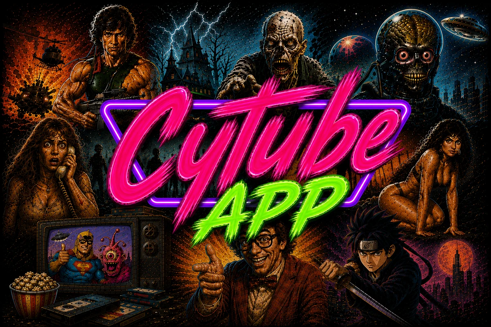
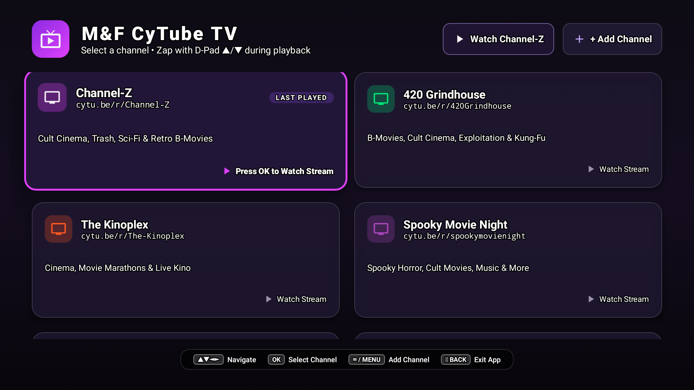
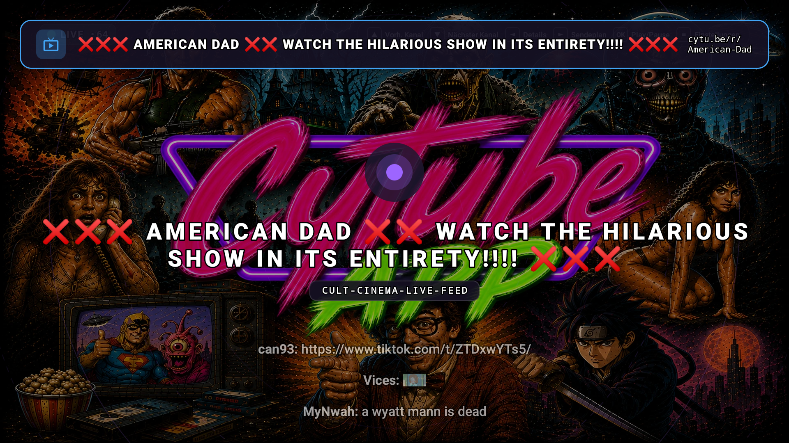
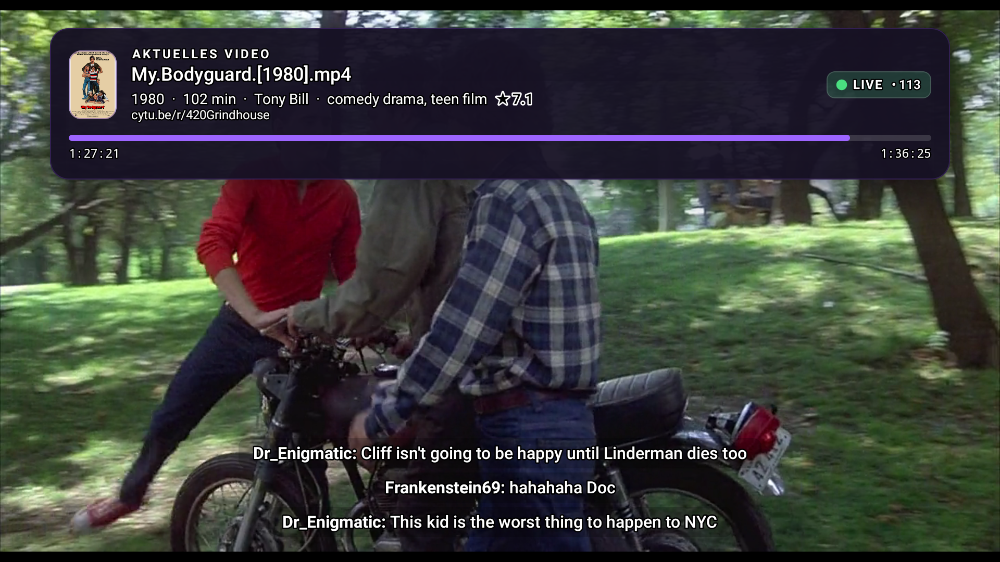

  
  <h1>📺 Unofficial CyTube TV App</h1>
  
<strong>Universal Multi-Channel Client for <a href="https://cytu.be">CyTube</a> on Android TV & Fire TV</strong>

  
  
  

---

  

---

**Unofficial CyTube TV** is a native, lean-back television client for **[CyTube](https://cytu.be)** rooms and communities. Engineered specifically for **Amazon Fire TV, Android TV, Smart TVs, and Android Handhelds**, it lets you browse rooms, zap through live channels with your D-Pad remote, and watch cinema marathons without mouse pointers or web browser lag.

Created by **Mike & Fried** — built by fans, for fans.

---

## 🎬 Key Features

* **🎛️ 10-Foot TV Channel Hub:**  
  Instant visual grid with live room cards, active badges, and one-click access to top CyTube communities.
* **⚡ Real-Time D-Pad Channel Zapping:**  
  Switch channels seamlessly during live playback using **D-Pad ▲ (UP) / ▼ (DOWN)**. An animated OSD HUD banner reveals the new channel, badge color, and current movie title.
* **➕ Custom Room Support:**  
  Easily add, manage, and delete any custom CyTube channel (e.g. `cytu.be/r/your-room`) directly on your TV.
* **🌐 Live Public Directory & Smart Presets:**  
  Automatically synchronizes with live public channels from [cytu.be](https://cytu.be/) on startup, with **420 Grindhouse** (`420Grindhouse`) as the default home channel.
* **🎥 Hybrid Playback Engine:**  
  Powered by **AndroidX Media3 ExoPlayer** for direct streams (HLS `.m3u8`, MP4, Google Drive) and hardware-accelerated WebView surfaces for YouTube and web media.
* **💬 Native Subtitle Chat Ticker:**  
  Live room chat glides across the bottom of the screen with customizable font size, max lines, and background opacity.
* **🎬 Smart Movie Info & Trivia:**  
  Automatic scene-tag cleaning (`1080p`, `BluRay`, `x264`) with background IMDb / Wikidata lookups for posters, release years, directors, and trivia facts.
* **📋 Live Schedule & Queue:**  
  Access the live queue and upcoming broadcasts with **D-Pad ► (RIGHT)**.

---

## 📸 Screenshots

| Channel Selection Hub | Live Player with Channel Zap HUD |
| :---: | :---: |
|  |  |

| Live Stream Fullscreen | Up Next Schedule & Queue |
| :---: | :---: |
|  |  |

---

## 🎮 TV Remote Controls

| Button | Function in Player | Function in Channel Hub |
| :--- | :--- | :--- |
| **▲ / ▼ (UP / DOWN)** | **Zap to Previous / Next Channel** (Instant Switch) | Move cursor up / down |
| **◄ / ► (LEFT / RIGHT)** | **◄ Trivia / Movie Info** • **► Schedule / Queue** | Move cursor left / right |
| **OK / SELECT** | Play / Pause Stream | Open & Watch Selected Channel |
| **≡ / MENU** | Open Settings Modal | Open "+ Add Custom Channel" Dialog |
| **⮌ BACK** | Return to Channel Hub | Prompt Exit Confirmation Dialog |
| **T / INFO** | Toggle Movie Details & Trivia Facts | — |

---

## 📱 Editions

| Edition | Target Devices | Application ID | Features |
| :--- | :--- | :--- | :--- |
| **📺 Android Light** | Amazon Fire TV, Android TV | `com.aistudio.mfcytube.kxbz` | 100% Leanback D-pad controls, minimal RAM footprint, transparent subtitle chat |
| **📱 Android Full** | Smartphones, Tablets | `com.aistudio.mfcytube.kxbz.full` | Interactive chat composer, CyTube login, user list, and wireless TV companion mode |

---

## 📥 Installation

1. Download the latest release from [Releases](https://github.com/kburna243/unofficial-cytube-app/releases/latest):
   * **Fire TV & Android TV:** `cytube-tv-light.apk`
   * **Smartphones & Tablets:** `cytube-tv-full.apk`
2. Sideload onto your Fire TV / Android TV using **Downloader**, **adbLink**, or `adb install -r cytube-tv-light.apk`.
3. Launch **Unofficial CyTube TV**, pick your favorite channel, and enjoy!

---

## 👥 Authors & Co-Creators

* **Fried** ([@kburna243](https://github.com/kburna243)) – Core Development, System Architecture, UI Design & Android Engineering
* **Mike** – Co-Development, Architecture, UI Design, Concept & Testing

---

## 🤝 Community & Credits

* 🌟 **[SPUDZARENEAT](https://github.com/spudzareneat):**  
  Special shoutout to SPUDZARENEAT! While we were building this native suite, he independently authored the great web-based TV companion **[grindhouse-tv](https://github.com/spudzareneat/grindhouse-tv)**. His work inspired our lead-time synchronization model.
* ⚙️ **[calzoneman/sync](https://github.com/calzoneman/sync):**  
  Immense appreciation to calzoneman and the developers behind the CyTube synchronization and WebSocket architecture.
* 🍿 **CyTube Community & Channel Operators:**  
  Special thanks to all channel hosts, DJs, moderators, and viewers keeping 24/7 cinema marathons alive across CyTube rooms.

---

## 🐛 Bugs, Ideas & Feedback

Encountered an issue or have a feature suggestion?
* 🚀 **In-App:** Open **Settings ➔ Problem melden** directly inside the app.
* 💻 **GitHub Issues:** Open an issue via our [GitHub Issues](https://github.com/kburna243/mf-cytube-app/issues/new) page.

---

## ❤️ Why We Made It

At the end of the day, this isn't a commercial product. It's a passion project made by fans, for fans, so we can all enjoy great cinema, live streams, and channel marathons together from the comfort of the couch without fighting browser interfaces.

Grab your remote, dim the lights, and see what's playing on CyTube tonight! 🍿🎬

---

## 📜 License & Disclaimer

* **License:** Licensed under the [GNU General Public License v3.0](LICENSE).
* **Disclaimer:** *This is an **unofficial, non-commercial community project**. It is not affiliated with, sponsored by, or endorsed by CyTube or individual channel administrators. All trademarks, media, and third-party services belong to their respective owners.*
